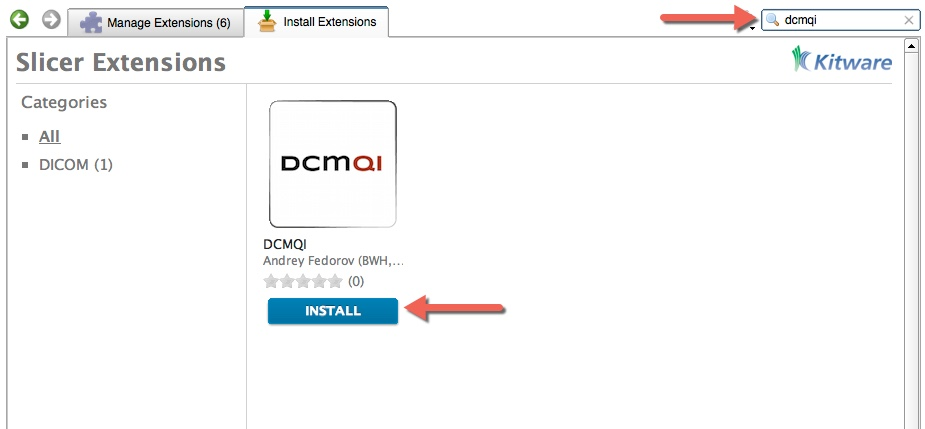

# Install `dcmqi` as a 3D Slicer extension

`dcmqi` should be available as an extension in the nightly version of [3D Slicer](http://slicer.org), starting November 2016. We always suggest that you use the latest (nightly) version of the software when you try it for the first time.

Download the latest **nightly release** for your platform from http://download.slicer.org. 

**Do NOT use installers tagged as "Stable Release"!**


After downloading, follow the installation procedure for your platform. 

If you use Mac, make sure you move the Slicer application to the Applications folder on your computer before launching it!

Once installed, open 3D Slicer Extension Manager by clicking the icon as shown below.


Search for `dcmqi` and install the extension by clicking the INSTALL button.



Once installation of `dcmqi` is completed successfully, you should have the binaries available on your system.

## Accessing `dcmqi` binaries

Location of the `dcmqi` binaries installed as 3D Slicer extension will be operating system specific.

### Mac OS X

`<Slicer.app folder>/Extensions-<number>/DCMQI/lib/Slicer-4.7/cli-modules/`

### Linux

TBD

### Windows

`<your home folder>\AppData\Roaming\NA-MIC\Extensions-<latest number>\DCMQI\lib\Slicer-4.7\cli-modules`

To launch the `dcmqi` command line tools on Windows, you will need to use 3D Slicer launcher, otherwise shared library dependencies will not be resolved. Example invocation:

```
C:\Program Files\Slicer 4.7.0-2016-12-11\Slicer.exe \ 
   --launch itkimage2segimage --help
```

## Upgrade

It is currently not possible to upgrade `dcmqi` without upgrading the 3D Slicer application.

If you need to upgrade the software, download the latest nightly release of 3D Slicer and install `dcmqi` as explained above.

