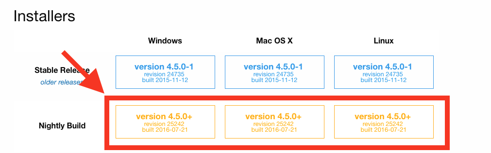
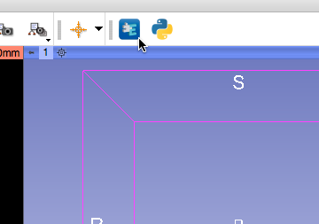
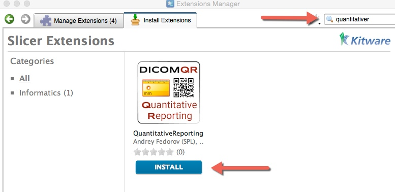

# Use `dcmqi` from the `QuantitativeReporting` 3D Slicer extension

You can access the functionality provided by `dcmqi` in 3D Slicer using `QuantitativeReporting` extension. Specifically, you can use `QuantitativeReporting` to prepare segmentations of DICOM imaging series, define semantics of the segmentation, calculate measurements and export the result as DICOM. You can also load DICOM segmentations, measurement structured reports and parametric maps with `QuantitativeReporting`, which is using `dcmqi` to support data conversion. See user guide of `QuantitativeReporting` for further details.

`dcmqi` itself is also available as a 3D Slicer extension. It provides the libraries and converters that can be integrated with other 3D Slicer extensions. If you are developing an extension for 3D Slicer, you can access `dcmqi` converters by specifying dependency on `dcmqi` 3D Slicer extension.

[`QuantitativeReporting`](http://slicer.org) should be available as an extension in the nightly version of [3D Slicer](http://slicer.org), starting November 2016. We always suggest that you use the latest (nightly) version of the software when you try it for the first time.

Download the latest **nightly release** for your platform from http://download.slicer.org. 

**Do NOT use installers tagged as "Stable Release"!**

After downloading, follow the installation procedure for your platform. 

If you use Mac, make sure you move the Slicer application to the Applications folder on your computer before launching it!

Once installed, open 3D Slicer Extension Manager by clicking the icon as shown below.

Search for `QuantitativeReporting` and install the extension by clicking the INSTALL button.

## Upgrade

It is currently not possible to upgrade an extension without upgrading the 3D Slicer application.

If you need to upgrade the software, download the latest nightly release of 3D Slicer and install `QuantitativeReporting` as explained above.

